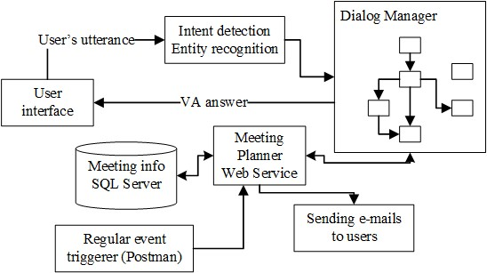

# MeetingPlanner

Meeting Planner prototype consists of 3 modules:

1. Meeting Planner Virtual Assistant created in platform https://va.tilde.com - the source code in folder `Bot`

2. Meeting Planner Web Service - the source code in folder `MeetingPlannerWS`

3. Meeting Planner database - the source code in folder `SQLDatabase`

## MeetingPlanner Virtual Assistant

## MeetingPlanner Web Service

## MeetingPlanner database

@Tilde, 2022
