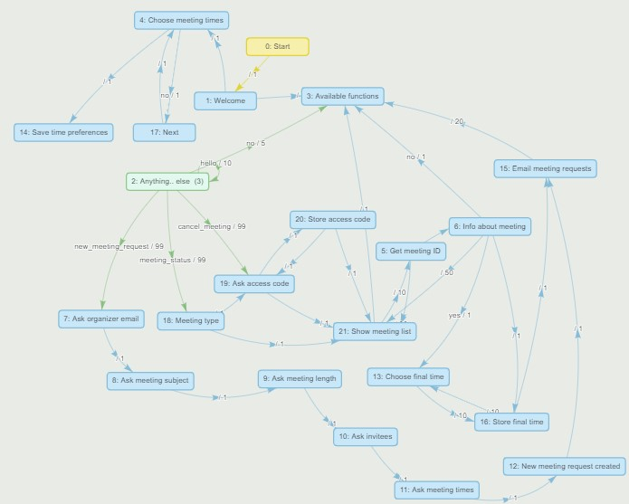
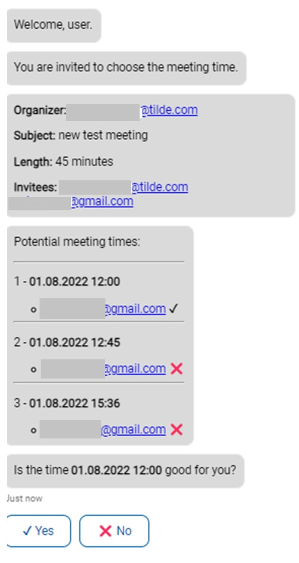

# MeetingPlanner

Meeting Planner prototype consists of 3 modules:

1. Meeting Planner Virtual Assistant created in platform https://va.tilde.com - the source code in folder `Bot`

2. Meeting Planner Web Service - the source code in folder `MeetingPlannerWS`

3. Meeting Planner database - the source code in folder `SQLDatabase`

## The architecture of the Meeting Planner

## MeetingPlanner Virtual Assistant

3 main scenarios are available for the **Meeting Planner**.

1.	Scheduling a new meeting

Conversation partners: Virtual Assistant and Meeting organizer

After the meeting organizer choses to schedule a new meeting the Virtual Assistant asks in a guided dialogue about meeting subject, length, e-mails of invitees and the organizer itself and the desired meeting times. This info is passed to the Web Service’s method *NewMeeting*.

2.	Choosing meeting time

Conversation partners: Virtual Assistant and Invitee

Invitee opens Web chat URL sent to him/her by e-mail. Virtual Assistant calls the Web Service’s method *GetMeetingInfo* by passing meeting ID that is in the URL.

In a guided dialog Virtual Assistant displays info about the meeting and asks to mark the preferred meeting times. After, Virtual Assistant calls the Web Service’s method *SaveInviteeChoice* that saves user preferences in the database.

3.	Other functions available to the meeting organizer

Conversation partners: Virtual Assistant and Meeting organizer

-	Meeting organizer opens Web chat and chooses to see the meetings he/she is organizing or participating.
-	Virtual Assistant displays the list of meetings and asks to specify item number from the list of meetings and calls the Web Service’s method *GetMeetingInfo* by passing meeting ID.
-	Virtual Assistant displays the info about the meeting and invitees’ responses.
-	Virtual Assistant offers meeting organizer to set the final time for the meeting (if the meeting status is ‘active’) and calls the Web Service’s method *ScheduleMeeting*  by passing meeting ID and meeting time. Invitees are notified by the e-mail.
-	The meeting organizer also can choose to cancel some meeting. In this case, the status of the meeting is changed to ‘canceled’ and invitees notified by the e-mail.

In example dialog the Virtual Assistant is asking invitee to vote for every potential meeting time.

## MeetingPlanner Web Service

Web Service has 8 methods:

-	Method *NewMeeting* – info about a new meeting is stored in the database
    -	Parameter *emails* – meeting organizer e-mail (as the first) and e-mails of invitees, e-mails separated by semicolon
    -	Parameter *subject* – subject of the meeting
    -	Parameter *length* – length of the meeting
    -	Parameter *times* – potential times of the meeting in form dd.mm.yyyy hh:mm separated by semicolon
  
-	Method *SaveInviteeChoice* – info about the invitee’s preferred time is stored in the database
    -	Parameter *invitee* – ID of the invitee
    -	Parameter *meeting* – ID of the meeting
    -	Parameter *times* – preferred time/s of the meeting in form dd.mm.yyyy hh:mm separated by semicolon
  
-	Method *GetMeetingInfo* – returns general information about meeting and info about times that invitees prefer
    -	Parameter *meeting* – ID of the meeting to check
  
-	Method *SendReminders* - sends reminders to invitees
    -	Parameter *meeting* – ID of the meeting
    -	Parameter *time*:
      -	‘-’ - sends reminders to invitees that have not responded
      -	‘0’ - sends e-mails telling that meeting has been canceled
      -	other value - sends emails about the final accepted time for the meeting
    
-	Method *ScheduleMeeting* – the final meeting time is stored in database
    -	Parameter *meeting* – ID of the meeting
    -	Parameter *time* – preferred time for the meeting in form dd.mm.yyyy hh:mm or ‘0’ if the meeting should be canceled
    
-	Method *GetMeetingList* – gets the list of meetings filtered by access code
    -	Parameter *code* – access code of the person
    -	Parameter *meetingtype*:
      -	‘1’ – meetings the person is invited to
      -	‘0’ – meetings the person has organized
    
-	Method *Trigger* – checks status of all meetings, e-mails links to the bot Web chat window to the invitees asking to vote for the preferred time (links contain invitee ID, invitee access code, and  meeting ID), or sends reminders to invitees that have not responded, informs organizer/s, sends information about final time of the meeting.

-	Method *SendCode* – sends 10-symbol Meeting Planner access code to the e-mail address
    -	Parameter *email*  – e-mail address

Meeting Planner Web Service uses 3 variables that must be added to the environment variables (or to Application settings of the App service if the container is deployed to the MS Azure portal):

1. Sql_connect - ODBC connection string to SQL Server
 
2. SMTPSender - e-mail address from which e-mails are sent
  
3. APIKey - API key for the SendGrid mail server

## MeetingPlanner database

Meeting Planner database has 5 tables.

-	*Meeting* table has unique meeting identifier, organizer identifier, meeting subject and length, meeting creation time, and status of meeting. Possible values of the field *Status* are ‘active’, ‘approved’, ‘canceled’.

-	*Meeting times* table has potential meeting times for the meeting. The field *Approved* holds information which time is the final for the meeting: 1 – this time is the final, 0 – for other potential times.

-	*Persons* table has unique person identifier, the person’s e-mail and unique 10-symbol access code.

-	*Invitees* table has identifiers of persons invited for the particular meeting, and the last time when the invitation e-mail was sent (field *Last time reminded* is empty if the e-mail is not yet sent).

-	*Accept status* table has information how each invitee responded about each proposed time of the meeting in the field *Status*. Possible values: 1 – time accepted, 0 – time rejected. 

## Acknowledgment
This prototype is created in activity 2.1 of the project "AI Assistant for Multilingual Meeting Management" (No. of the Contract/Agreement: 1.1.1.1/19/A/082).

@Tilde, 2022
